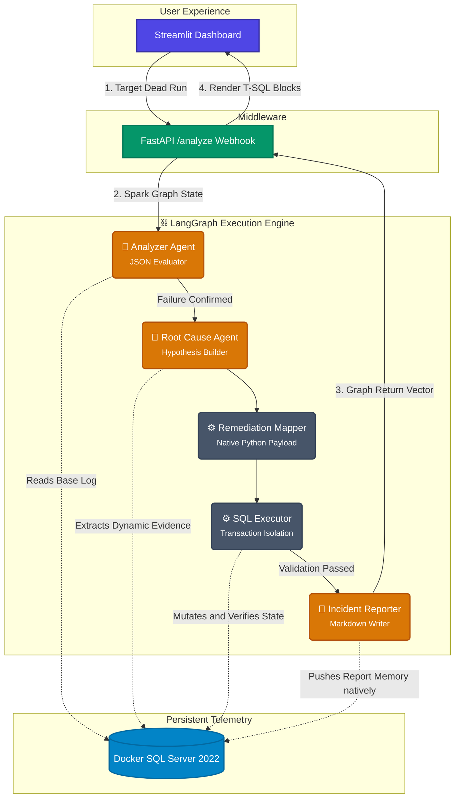

# AI Data Ops Agent — Oilfield Edition
## Complete Project Guide & SOP

---

## What We Built

A multi-agent AI system that comprehensively monitors an Oklahoma oilfield daily production ETL pipeline.
When the pipeline fails, a specialized LangGraph AI team autonomously executes the following:
1. Detects the pipeline failure and definitively classifies the anomaly type.
2. Reasons about the root cause using dynamically injected database diagnostics.
3. Generates a secure T-SQL patch structurally matched to the anomaly.
4. Executes and seamlessly validates the SQL natively.
5. Persists a structured Markdown incident report physically returning states to Streamlit.

**Stack:** LangGraph · LangChain · Gemini API · SQL Server · SQLAlchemy · FastAPI · Streamlit

---

## Prerequisites
- Homebrew
- Docker Desktop
- Python 3.9
- sqlcmd
- ODBC Driver 17 for SQL Server
- unixodbc

---

## Installation & Setup

```bash
# 1. Start SQL Server
docker compose up -d
# Wait 20 seconds for the database to boot

# 2. Apply the oilfield schema
sqlcmd -S localhost,1434 -U sa -P 'StrongPass123' -i database/schema.sql -C

# 3. Provision the Python environment
python3 -m venv .venv
source .venv/bin/activate
pip install -r requirements.txt

# 4. Configure environment variables
cp .env.example .env
# Open .env and add your GOOGLE_API_KEY for the Gemini Flash context

# 5. Verify the backend connection
python3 -c "from database.db import run_scalar; print(run_scalar('SELECT DB_NAME()'))"
```

---

## Project Structure

```
oilfield_agent/
├── config/
│   └── settings.py          # Environment settings, logic thresholds
├── database/
│   ├── schema.sql            # Persistent SQL Server DDL
│   └── db.py                 # SQLAlchemy bridging + execute routines
├── etl/
│   └── pipeline.py           # Daily production ETL generator
├── agents/
│   ├── state.py              # LangGraph Pydantic TypedDict definition
│   ├── monitor.py            # AI Analyzer - Reads etl_log, evaluates conditions, sets failure flags
│   ├── root_cause.py         # AI Root Cause - Dynamic telemetry querying
│   ├── remediation.py        # Automation Script - Pull native T-SQL sequences
│   ├── executor.py           # SQL Hook - Executes and validates the patches securely
│   └── reporter.py           # Markdown & Persistence - Pushes metrics to DB memory
├── graph/
│   └── data_ops_graph.py     # High-speed LangGraph machine
├── api/
│   └── main.py               # Fast API analytical hooks
├── dashboard/
│   └── app.py                # Streamlit Operations Center
└── tests/
    └── test_agents.py        # Pipeline regression tests
```

---

## Operational SOP

### 1. Generating Daily Data
Run the internal pipeline simulator to securely populate the SQL table with generated telemetry anomalies.

```bash
python3 -m etl.pipeline                              # Clean telemetry sequence
python3 -m etl.pipeline --failure-mode schema_drift  # Triggers drifting schemas
python3 -m etl.pipeline --failure-mode null_explosion# Triggers 38% SCADA blackout
python3 -m etl.pipeline --failure-mode row_count_drop# Modifies packet load percentages
python3 -m etl.pipeline --failure-mode type_mismatch # Casts incorrect strings
```

### 2. Failure Matrices
| Mode | Real-world Cause | Fix Strategy |
|------|-----------------|-------------|
| **schema_drift** | Vendor adds condensate metrics unannounced | Truncate out-of-band columns, execute clean load only |
| **null_explosion** | Meter outage rendering massive NULL holes | Null rows flagged in staging, clean data extracted independently |
| **row_count_drop** | Tower failure causing drop in total packet delivery | Identify missing wells, flag run as PARTIAL pending SCADA review |
| **type_mismatch** | Vendor appends raw strings into numeric scopes | Natively cast structural patches onto `gas_mcf` scope strings |

### 3. Activating The Dashboard
Boot up the full application stack using matching terminal windows:

**Terminal 1 (Backend Webhooks):**
```bash
source .venv/bin/activate
uvicorn api.main:app --reload
```

**Terminal 2 (Frontend Dashboard):**
```bash
source .venv/bin/activate
streamlit run dashboard/app.py
```

### 4. Graph Architecture
Our system enforces strict, deterministic routing schemas dynamically built alongside LangGraph primitives:



### 5. Architectural Paradigms

**Ultra-Low Latency Inference:** The graph compresses AI processing dependencies. Instead of firing arbitrary LLMs iteratively, the `monitor_agent` maps summary logs, extracts enums, and computes confidence scores *all natively mapped inside a single structured JSON response packet*, allowing `gemini-2.5-flash` to process massive context cycles flawlessly.

**Zero-Hallucination Execution:** The `remediation.py` hook isn't vulnerable to SQL hallucinations. Telemetry anomalies securely map to hard-coded native python dictionaries ensuring syntax errors drop to zero and limiting retry latency entirely.

**Database Context Memory:** `reporter.py` permanently maps generated markdown logic right back into the primary SQL structure `dbo.etl_run_log` directly so physical dashboard refreshes inherently remember historically mitigated sequences seamlessly.
